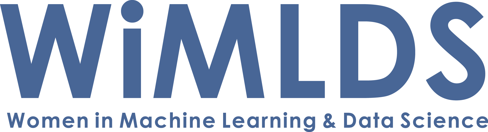
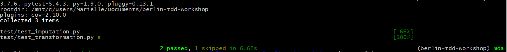

# Unit Testing for Data Science


This repository contains workshop materials for "Unit Testing for Data Science" organized by Berlin Women in Machine Learning and Data Science on 1 July 2020.

Authors: Ellen König, Tereza Iofciu, Marielle Dado
---

## Before the workshop: Setup your computer

NOTE: You must run the entire set-up **BEFORE** the workshop. The following instructions need to be run in a terminal (works best with bash shell).

### Step 1: Requirements

There are three ways to setup your machine for the workshop, you should use the one that you are most familiar with. One is via conda, another via pyenv and the other with virtual env and pip.

- conda

OR

- pyenv >= 1.2.13
- python >= 3.7.0
- poetry >= 1.0.0 (to be installed in your local pyenv)

OR

- venv
- python >= 3.7.0


### Step 2: Clone the workshop repository

Clone the repo locally:

```bash script
git clone https://github.com/wimlds/berlin-tdd-workshop
cd berlin-tdd-workshop
```

### Step 3: Setup and activate your virtual environment

Choose your preferred setup:

with **conda**:

```bash script
# install working environment with conda
conda env create -n berlin-tdd-workshop -f environment.yml

# environment should be activated now
# if not type: source activate berlin-tdd-workshop
```

If you're getting errors, updating conda might help, run: `conda update -n base -c defaults conda`

With **pyenv and poetry**:

```bash script
pyenv local 3.7.4
pip install poetry
make setup                          #if you use a different python version update that in pyproject.toml
source .venv/bin/activate           #to activate the environment
```

With **venv**:

```bash script
python3 -m venv .wimlds_venv
source .wimlds_venv/bin/activate
pip install -r requirements.txt
source .venv/bin/activate           #to activate the environment
```


### Step 4: Run test

Start environment and run this command in your terminal:

`pytest` or `pytest -vv` for verbose output

This should return a test has passed and some were skipped (see image below).

---
## About the workshop

### What are we expected to do at the workshop?

In this workshop, there are 3 exercises that involve one or both of the following tasks:
1. **Writing functions** for data imputation and data transformation.
2. **Writing unit tests** to test the functions you have written.

The instructors and mentors will guide you through the workshop content and materials

### Which files are we working on? Should we use Jupyter notebooks or an IDE?

We prepared the following files and folders for you to work on:
1. [data/EDA](data/EDA.ipynb) - a notebook for exploring the dataset
2. [scripts](scripts) folder - contains the Python functions in following script files:
- [scripts/imputation.py](scripts/imputation.py) - functions for data imputation
- [scripts/transformation.py](scripts/transformation.py) - functions for data transformation
3. [test](test) folder - contains the unit tests following scripts:
- [test/test_imputation.py](test/test_imputation.py) - unit tests for functions in [scripts/imputation.py](scripts/imputation.py)
- [test/test_transformation.py](test/test_transformation.py) - unit tests for functions in [scripts/transformation.py](scripts/transformation.py)

In order to run successfully the unit tests you create, **the functions and unit tests must be placed in the Python scripts**. That means that the functions you write for data imputation should be placed in [scripts/imputation.py](scripts/imputation.py) and the corresponding unit tests should be in [test/test_imputation.py](test/test_imputation.py). For this, you will work on the scripts using an IDE of your choice.

However, you may also first write your functions/tests in [data/EDA](data/EDA.ipynb) using Jupyter notebooks and then transfer them in the appropriate Python scripts later.

### What dataset are we using?

We prepared some data for the workshop using a Pockets dataset from [the-pudding](https://github.com/the-pudding/). In order to try out different imputation methods we removed 10% of the price values. If you want to take a look at all the data check the [data/PrepareWorkshopData](data/PrepareWorkshopData.ipynb) notebook. We will not cover this through the workshop.

### Where can we ask for help?

The instuctors and mentors can answer your questions on the #meetup-berlin-workshop-help channel on the WiMLDS Global Slack workspace.